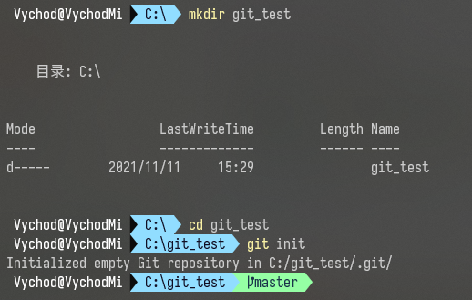

## 学习使用 Git 进行版本管理

### 什么是 Git ？

既然要学习 Git ，那我们首先就肯定要知道 Git 是个什么东西。举个简单的例子，相信很多人都有过修改一个东西修改很多次的体验吧，最好的结果是最后达到了甲方的要求，但是没法保证甲方爸爸提出一句“第一版挺好的”，那么这个时候你就疯狂在电脑上找第一版，然后发现你始终用的是同一个文档进行修改，根本找不到第一版了。所以很多人开始养成了一些好习惯，一个作业进行的时候，每到一个关键点，就复制当前作业作为节点记录，也就是备份，这就是最简单的很容易想到的“版本管理”。但是这样带来的结果是，你的文件夹有一堆同样名字的文件，那么有的人会说了，我会按照时间把不同节点的文件起不一样的名字，这确实是一个很好的解决方法，但是你这个文件夹还是会有一大堆文件。如果你的单个文件比如说你的 word 很大，再如果你干了一个月每天都有两三个版本，那么你这一个月下来的文件占据存储空间的大小是非常庞大的。

多是一方面，难以管理是另一个大问题。老板说，你去给我找到 xxx 需求还没提出的那个版本，这个时候如果你想不起来是哪个时间，那么你的时间戳就毫无用处了；又有人要说了，我有版本管理文档，会记录每一版都修改了什么。你这么一说，还真把我说住了，不对，没有，完全没有，还是有个大问题，一个最大的问题，很多人都不是一个人在负责一份工作吧？肯定是有队友相互配合分工合作的吧？我们还是拿 word 举例子，比如说一个文件有三章，ABC三个人分别负责一章，最后怎么合并呢？简单的复制粘贴不就完了。那如果有一章三个人都参与修改了呢？那最后怎么合并呢？

2005年，Linus 花了两周的时间用 C 语言制作了 Git，这就是牛人吗？从这以后， Git 迅速成为了全世界最流行的分布式版本控制系统。2008年， Github 正式上线，成为了事到如今也是每个程序员心中最温暖的港湾（不是说抄代码哈）。

刚刚提到 Git 的时候有一个标签叫做 分布式，大家也可以很快想到它的反义词：集中式，那么这两种方式的版本控制系统到底有什么区别呢？

先说集中式版本控制系统，版本库是集中存放在中央服务器的，而干活的时候，用的都是自己的电脑，所以要先从中央服务器取得最新的版本，然后开始干活，干完活了，再把自己的活推送给中央服务器。中央服务器就好比是一个图书馆，你要改一本书，必须先从图书馆借出来，然后回到家自己改，改完了，再放回图书馆。曾经最常用的集中式版本控制系统有 CVS 和 SVN。

集中式版本控制系统最大的毛病就是必须联网才能工作，如果在局域网内还好，带宽够大，速度够快，可如果在互联网上，遇到网速慢的话，砸电脑的心都有了。

这就足以体验分布式的好处了。首先，分布式版本控制系统根本没有“中央服务器”，每个人的电脑上都是一个完整的版本库，这样，你工作的时候，就不需要联网了，因为版本库就在你自己的电脑上。既然每个人电脑上都有一个完整的版本库，那多个人如何协作呢？比方说你在自己电脑上改了文件A，你的同事也在他的电脑上改了文件A，这时，你们俩之间只需把各自的修改推送给对方，就可以互相看到对方的修改了。

和集中式版本控制系统相比，分布式版本控制系统的安全性要高很多，因为每个人电脑里都有完整的版本库，某一个人的电脑坏掉了不要紧，随便从其他人那里复制一个就可以了。而集中式版本控制系统的中央服务器要是出了问题，所有人都没法干活了。

### Git 的安装

鉴于我手头只有一台装有 win10 系统的工作本，所以我就只介绍一下 Windows 系统下的 Git 安装了，我们可以之间去[官网](https://git-scm.com/downloads)下载安装包。


当你开始菜单可以看到这几个小东西的时候，就说明你的 Git 已经安装好了。但是我们还需要进行一步操作，就是让你的 Git 有个标签，和这个世界上那么多的 Git 区分开来。让我们在命令行中输入下面两条命令：

```bash
$ git config --global user.name "Your Name"
$ git config --global user.email "example@email.com"
```

配置完毕之后，你的 Git 也就可以见到其他 Git 的时候进行自我介绍了。

这里的 `--global` 参数是指全局配置，你电脑所有的 Git 仓库都会用这个配置，当然也可以对不同的仓库进行不一样的配置

### 创建版本库

找个你喜欢的地方生成一个空目录，然后进去，然后初始化





这样的话，这个 git_test 文件夹就变成了一个使用 Git 来进行版本管理的仓库了。随之变化的是该文件夹里面会有一个 .git 文件夹，这里面是 Git 用来跟踪管理版本的，咱尽量还是别去动它哈，咱动不起......

有人说我看不见这个文件，你可以选择把 文件夹上方工具栏 -> 查看 -> 勾选 “隐藏的项目”


又有人说为什么我在命令行里面用高级的 linux 命令 ls 却看不见这个文件夹呢？这是因为它是默认隐藏的，如果你想看的话，你可以试试更高级的 ls -ah 哦

### 把文件添加到版本库

首先这里再明确一下，所有的版本控制系统，其实只能跟踪文本文件的改动，比如TXT文件，网页，所有的程序代码等等，Git也不例外。版本控制系统可以告诉你每次的改动，比如在第5行加了一个单词“Linux”，在第8行删了一个单词“Windows”。而图片、视频这些二进制文件，虽然也能由版本控制系统管理，但没法跟踪文件的变化，只能把二进制文件每次改动串起来，也就是只知道图片从100KB改成了120KB，但到底改了啥，版本控制系统不知道，也没法知道。

不幸的是，Microsoft的Word格式是二进制格式，因此，版本控制系统是没法跟踪Word文件的改动的，前面我们举的例子只是为了演示，如果要真正使用版本控制系统，就要以纯文本方式编写文件。

因为文本是有编码的，比如中文有常用的GBK编码，日文有Shift_JIS编码，如果没有历史遗留问题，强烈建议使用标准的UTF-8编码，所有语言使用同一种编码，既没有冲突，又被所有平台所支持。

随便在其他地方写好一个 readme.txt，再在里面写上两行自己想写的话，这里我打算写

```
Git is a version control system.
Git is free software.
```

然后把它拖到 git_test 里面，再在终端 cd 到这个目录，将你想上传的文件 add 一下，就相当于告诉 Git，我要上传这个文件，你先拿笔给我记好咯！

```bash
$ git add readme.txt
```

add 之后如果你想添加其他文件，你可以继续 add ，但是要确保你所 add 的文件存在于当前目录下；如果你想把当前文件夹里面的所有东西都 add 你可以选择高级的 `git add . ` 

```bash
$ git add .
```

这个高级的点，是很多人常用的吧，一键就完事了

如果你想知道现在 Git 都记下了什么文件，你可以使用一个 Git 命令来查询 `git status`


如果你想上传的东西都让 Git 记好了，那么你就可以让 Git 把你的这些东西上传到版本库里面去了

```bash
$ git commit -m "this is my first commit"
```

`-m`后面输入的是本次提交的说明，可以输入任意内容，当然最好是有意义的，这样你就能从历史记录里方便地找到改动记录


`git commit` 命令执行成功后会告诉你，`1 file changed`：1个文件被改动（我们新添加的readme.txt文件）；`2 insertions`：插入了两行内容（readme.txt有两行内容）。

### Git 怎么干活的

我们已经成功地添加并提交了一个readme.txt文件，现在，是时候继续工作了，于是，我们继续修改readme.txt文件，改成如下内容：

```
Git is a distributed version control system.
Git is free software.
```

这个时候再查询一下`git status`


我们可以大概看出的意思就是，我改了这个文件，但是没有上传到 commit 里面。

但如果是别人修改的呢？你要怎么才能知道别人进行了什么修改呢？我们就要学习一个新的 Git  命令了：`git diff`， diff 也就是 diffrence 嘛（疯狂炫耀扎实的小学英语基础）


这里的话 减号 就是代表被修改的，加号 表示修改完的模样

修改完了，那我们肯定得提交啊，add commit 一气呵成，我太牛了把这也


nothing to commit, working tree clean

完事了？下班！

不对还没下班，还有几个神奇功能没告诉大家呢！

#### 版本回退

那么多此提交之后，那我该咋知道这个仓库的提交情况呢？让我们来试一下

```bash
$ git log
# 如果想要简洁点可以试试下面这个
$ git log --pertty=oneline
```

理论上来说我们可以看到三条提交信息

1. 最近一次的提交信息
2. 上一次的提交信息
3. 最早的一次的提交信息

那么我想回到上一个版本的话，我该怎么做呢？

在 Git 中，使用 `HEAD` 代表当前版本，上一个版本是 `HEAD^` ，上上一个版本是 `HEAD^^` ，那么往前一百个呢？你当然可以选择使用100个 ^，但是这里我们更推荐使用 `HEAD~100` 。


通过观察 id 号我们可以发现确实是实现了版本回退

这个时候你如果说，我不想回退了，我反悔了，嘿嘿，这颗有点麻烦咯，如果你使用 `git log` 你会发现刚刚那个 commit 消失了！

别急别急，我们往上滑，找到刚刚那条的 ID，deb08f...... 对对对，就是这个，看我来施展魔法


嘿嘿！成功了

这里的 id 是使用 SHA1 进行编码的时间戳，可以支持一个模糊搜索，但是建议至少四五位这样子，要不然可能会找出来两条 id 前缀一样的 commit 信息

但是如果你关闭了电脑之后才后悔了咋办呢？别急，Git 还留了一手


使用 `git reflog` 可以显示你在当前仓库执行的每一次命令

#### 工作区和暂存区

工作区与暂存区其实不是同级的。根据工作逻辑我们可以有 工作区 和 版本库 两个分类。工作区 指单个用户在电脑可以看到的目录，比如我们到目前为止一直在操作的 git_test 文件夹。与之相对的就是版本库，指当前这个多人协作的项目也就是工作区文件夹里面的 .git 文件夹，它就是当前项目的一个版本库。

版本库里面主要包含两个部分 stage 和 master，stage 就是 暂存区 ，master 是 Git 自动创建的第一个分支，master 分支拥有一个叫做 HEAD 的头指针。

结合之前的 add 和 commit 我们来分析一下 工作区 和 暂存区

首先 `git init` 之后，我们就参与到了一个协同的项目中去，你在这个文件夹下的所有文件都处于你自己的一个 工作区 中，当你在终端输入 `git add xxx` 操作之后，你的这些文件就会被同步到 .git 中的 暂存区，当你停止添加并执行 `git commit` 命令之后，Git 会将 暂存区 中的文件推到 master 分支上去，当然你也可以自行选择其他分支

这整个过程都可以在每一步完成之后只用 `git status` 来监视文件动向

#### 管理修改

为了更好理解 Git 到底哪里好，我们可以试着去完成下面这个流程

第一次修改 -> `git add` -> 第二次修改 -> `git commit` 

执行结束过后我们会发现，第二次的修改并没有同步到版本库中，当前版本存的文件还是第一次修改后的样子

为什么会这样呢？那是因为 Git 跟踪并管理的是修改，而非文件。增删一行、修改字符、创建一个新文件... 这些都是对原有文件的以原有文件为基础的一个修改

所以为了确保万无一失，大家可以选择在每一个 commit 之前百分百加上一个 add

#### 撤销修改

首先介绍一下这个命令格式

```bash
$ git checkout -- filename
```

这个命令的作用就是，把 filename 在工作区的修改全部撤销，这里会有两种情况：

1. filename 修改之后还没有执行 add，也就是还没有进入暂存区，这时候撤销，就会回到和版本库一模一样的版本
2. filename 上一次的修改之后已经 add 进入了暂存区，在这次修改后执行 撤销，就会回到上一个版本，也就是和暂存区中的版本是一样的

这时候大家觉得这个 `git checkout` 和我们刚刚学的 `git reset` 有什么区别呢，其实还是有一定区别的

`git reset` 是把 暂存区 的修改撤销掉，就是和 Git 说我不提交了，你还给我，然后我就拿着 Git 还回来的版本覆盖了本地 工作区 的版本

二者的区别主要是一个文件传输方向的区别

> 新版 Git 把 `git reset` 修改成了 `git restore` ，但是使用旧指令仍旧可以完成想要完成的操作

所以为了更好的理解两种命令，我们可以列出几个场景：

场景一：我修改了工作区一个文件的内容，想直接丢弃工作区的修改，选择 `git checkout -- <file>`

场景二：我不仅改了，我还 add 了，进了 暂存区 了，但是我想放弃这个 add，那就使用 `git reset HEAD <file>` ，这个时候也就是回到了场景一了，你已经在 工作区 修改完了

场景三：我 commit 都，才后悔，这个时候就需要 `git reset --hard HEAD^`

#### 删除文件

### 远程仓库

Git是分布式版本控制系统，同一个Git仓库，可以分布到不同的机器上。怎么分布呢？最早，肯定只有一台机器有一个原始版本库，此后，别的机器可以“克隆”这个原始版本库，而且每台机器的版本库其实都是一样的，并没有主次之分。

我们选择找一台电脑充当服务器的角色，每天24小时开机，其他每个人都从这个“服务器”仓库克隆一份到自己的电脑上，并且各自把各自的提交推送到服务器仓库里，也从服务器仓库中拉取别人的提交。

你可以选择把自己的服务器配置成可以运行 Git ，但是初学者完全可以考虑使用 Github 的 Git 仓库托管服务的功能。也就是说，要注册一个GitHub账号，就可以免费获得Git远程仓库。

**第1步：创建 SSH key**

第1步：创建SSH Key。在用户主目录下，看看有没有.ssh目录，如果有，再看看这个目录下有没有`id_rsa`和`id_rsa.pub`这两个文件，如果已经有了，可直接跳到下一步。如果没有，打开Shell（Windows下打开Git Bash），创建SSH Key：

```bash
$ ssh-keygen -t rsa -C "youremail@example.com"
```

把邮箱修改自己的邮箱地址，然后一路回车顺通无阻

之后前往文件夹看一眼


ok！get it！

**第2步：连接 Github**

登陆GitHub，打开“Account settings”，“SSH Keys”页面


然后，点“Add SSH Key”，填上任意Title，在Key文本框里粘贴`id_rsa.pub`文件的内容


点“Add Key”，你就应该看到已经添加的Key


#### 添加远程库


一步一步走下来就是创建好了一个 github 上面的仓库了，2：仓库名称；3：仓库介绍


我们可以看到两种方法添加远程仓库，第一种就是你本地啥都没有，第二种是你存在一个工作区

如果从头走到现在，那么我们应该使用的是第二种方法

```bash
# 添加连接
$ git remote add origin git@github.com:vychodlc/git_test.git 
# 建立分支
$ git branch -M main
# push!
$ git push -u origin main
```

接下来我们就可以看到非常 nice 的界面了


接下来我们刷新刚刚建立的仓库


ok，就是这么简单！


> 接下来对刚刚命令中的一些点来多说几句：
>
> 1. 添加连接时的 `origin` 是可以随便起的名字，你也可以起自己喜欢的名字，如果添加之后想删除的话，就可以执行 `git remote remove <name>` 
> 2. 建立分支时的 `-M`  则可以实现强制修改分支的名称
> 3. 推流时的 `git push <远程主机名> <本地分支名>:<远程分支名>` 
> 4. push 的时候可以使用 `git push --force origin master`  进行强制推送，会导致远程资源库被覆盖，这个尽量避免使用

#### 从远程库克隆

```bash
$ echo "# git_test" >> README.md
$ git init
$ git add README.md
$ git commit -m "first commit"
$ git branch -M main
$ git remote add origin git@github.com:vychodlc/git_test.git
$ git push -u origin main
```

要克隆一个仓库，首先必须知道仓库的地址，然后使用 `git clone` 命令克隆。

Git支持多种协议，包括 `https` ，但 `ssh` 协议速度最快。

### 分支管理

#### 创建和合并分支

[创建与合并分支 - 廖雪峰的官方网站 (liaoxuefeng.com)](https://www.liaoxuefeng.com/wiki/896043488029600/900003767775424)

#### 解决冲突

[解决冲突 - 廖雪峰的官方网站 (liaoxuefeng.com)](https://www.liaoxuefeng.com/wiki/896043488029600/900004111093344)

#### 分支管理策略

[分支管理策略 - 廖雪峰的官方网站 (liaoxuefeng.com)](https://www.liaoxuefeng.com/wiki/896043488029600/900005860592480)

#### Bug 分支

[Bug分支 - 廖雪峰的官方网站 (liaoxuefeng.com)](https://www.liaoxuefeng.com/wiki/896043488029600/900388704535136)

#### Feature 分支

[Feature分支 - 廖雪峰的官方网站 (liaoxuefeng.com)](https://www.liaoxuefeng.com/wiki/896043488029600/900394246995648)

#### 多人协作

[多人协作 - 廖雪峰的官方网站 (liaoxuefeng.com)](https://www.liaoxuefeng.com/wiki/896043488029600/900375748016320)

#### Rebase

[Rebase - 廖雪峰的官方网站 (liaoxuefeng.com)](https://www.liaoxuefeng.com/wiki/896043488029600/1216289527823648)

### 标签管理

现在有两个场景

1. “请把上周一的那个版本打包发布，commit号是6a5819e...”

   “一串乱七八糟的数字不好找！”

2. “请把上周一的那个版本打包发布，版本号是v1.2”

   “好的，按照tag v1.2查找commit就行！”

大家应该都会选择第二种，那么我们就需要给每一个版本打一个标签，也就是 `tag`

#### 创建标签

- 首先，切换到需要打标签的分支上

- 命令 `git tag <tagname>` 用于新建一个标签，默认为 `HEAD` ，也可以指定一个commit id；
- 命令 `git tag -a <tagname> -m "blablabla..."` 可以指定标签信息；
- 命令 `git tag` 可以查看所有标签。

#### 操作标签

- 命令 `git push origin <tagname>` 可以推送一个本地标签；
- 命令 `git push origin --tags` 可以推送全部未推送过的本地标签；
- 命令 `git tag -d <tagname>` 可以删除一个本地标签；
- 命令 `git push origin :refs/tags/<tagname>` 可以删除一个远程标签

### 自定义 Git

#### 忽略特殊文件

- 忽略某些文件时，需要编写`.gitignore`；
- `.gitignore`文件本身要放到版本库里，并且可以对`.gitignore`做版本管理！

#### 自定义别名

```bash
$ git config --global alias.st status
```

这行代码的作用执行之后，我们就可以在命令行操作的时候用 `git st` 去代替 `git status` 

配置Git的时候，加上`--global`是针对当前用户起作用的，如果不加，那只针对当前的仓库起作用。每个仓库的Git配置文件都放在`.git/config`文件中

#### 搭建 Git 服务器

1. 安装`git`

   ```bash
   $ sudo apt-get install git
   ```

2. 创建一个`git`用户，用来运行`git`服务

   ```bash
   $ sudo adduser git
   ```

3. 创建证书登录

   收集所有需要登录的用户的公钥，就是他们自己的 `id_rsa.pub` 文件，把所有公钥导入到 `/home/git/.ssh/authorized_keys` 文件里，一行一个

4. 初始化Git仓库

   ```bash
   # 先选定一个目录作为Git仓库，假定是/srv/sample.git，在/srv目录下输入命令：
   $ sudo git init --bare sample.git
   # Git就会创建一个裸仓库，裸仓库没有工作区，因为服务器上的Git仓库纯粹是为了共享，所以不让用户直接登录到服务器上去改工作区，并且服务器上的Git仓库通常都以.git结尾。然后，把owner改为git：
   $ sudo chown -R git:git sample.git
   ```

5. 禁用shell登录

   出于安全考虑，第二步创建的git用户不允许登录shell，这可以通过编辑 `/etc/passwd` 文件完成。找到类似下面的一行：

   ```bash
   git:x:1001:1001:,,,:/home/git:/bin/bash
   # 改为：
   git:x:1001:1001:,,,:/home/git:/usr/bin/git-shell
   ```

6. 克隆远程仓库

   ```bash
   $ git clone git@server:/srv/sample.git
   ```

> - **管理公钥**：如果团队很小，把每个人的公钥收集起来放到服务器的 `/home/git/.ssh/authorized_keys` 文件里就是可行的。如果团队有几百号人，就没法这么玩了，这时，可以用[Gitosis](https://github.com/res0nat0r/gitosis)来管理公钥。
>
> - **管理权限：**Git是为Linux源代码托管而开发的，所以Git也继承了开源社区的精神，不支持权限控制，但是也是可以通过 钩子 去完成权限管理，可以但没有必要

### 结束语

貌似就学完了吧，这是我写的第一篇教程，其中也有很多地方是借鉴的别人的思路，虽然用了这么长时间 Git ，但是这么一整个复习下来，真的感觉整个人都通透了，很多不理解的点也变得更加清晰了

最后附上一本 Git 万能工具书，是廖雪峰老师发在他的个人网站上的。
